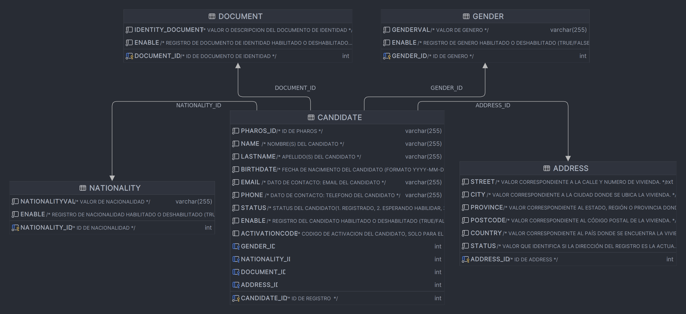

# PharosDBmapper
Pharos DBmapper will provide access to the Pharos Database exposing endpoints to execute CRUD operations and criteria based queries.

## Physical model ##

## Endpoints exposed ##

### Health ###

| Endpoint      | GET | POST | PUT | DELETE | 🔒 |
|:--------------|:----|:-----|:----|:-------|:---|
| /api/health   | x   |      |     |        |    |
| /api/v1/login |     | x    |     |        |    |

### Address ###
| Endpoint                       | GET | POST | PUT | DELETE | 🔒 |
|:-------------------------------|:----|:-----|:----|:-------|:---|
| /api/v1/address/getAddress     | x   |      |     |        | x  |
| /api/v1/address/getAddressList |     | x    |     |        | x  |
| /api/v1/address/createAddress  |     | x    |     |        | x  |
| /api/v1/address/updateAddress  |     |      | x   |        | x  |
| /api/v1/address/deleteAddress  |     |      |     | x      | x  |

### Candidate ###
| Endpoint                             | GET | POST | PUT | DELETE | 🔒 |
|:-------------------------------------|:----|:-----|:----|:-------|:---|
| /api/v1/candidate/getCandidate       | x   |      |     |        | x  |
| /api/v1/candidate/getCandidatesList  |     | x    |     |        | x  |
| /api/v1/candidate/createCandidate    |     | x    |     |        | x  |
| /api/v1/candidate/updateCandidate    |     |      | x   |        | x  |
| /api/v1/candidate/deleteCandidate    |     |      |     | x      | x  |

### Document ###
| Endpoint                             | GET | POST | PUT | DELETE | 🔒 |
|:-------------------------------------|:----|:-----|:----|:-------|:---|
| /api/v1/document/getCandidate        | x   |      |     |        | x  |
| /api/v1/document/getCandidatesList   |     | x    |     |        | x  |
| /api/v1/document/createCandidate     |     | x    |     |        | x  |
| /api/v1/document/updateCandidate     |     |      | x   |        | x  |
| /api/v1/document/deleteCandidate     |     |      |     | x      | x  |

### Gender ###
| Endpoint                      | GET | POST | PUT | DELETE | 🔒 |
|:------------------------------|:----|:-----|:----|:-------|:---|
| /api/v1/gender/getGender      | x   |      |     |        | x  |
| /api/v1/gender/getGenderList  |     | x    |     |        | x  |
| /api/v1/gender/createGender   |     | x    |     |        | x  |
| /api/v1/gender/updateGender   |     |      | x   |        | x  |
| /api/v1/gender/deleteGender   |     |      |     | x      | x  |

### Nationality ###
| Endpoint                               | GET | POST | PUT | DELETE | 🔒 |
|:---------------------------------------|:----|:-----|:----|:-------|:---|
| /api/v1/nationality/getNationality     | x   |      |     |        | x  |
| /api/v1/nationality/getNationality     |     | x    |     |        | x  |
| /api/v1/nationality/createNationality  |     | x    |     |        | x  |
| /api/v1/nationality/updateNationality  |     |      | x   |        | x  |
| /api/v1/nationality/deleteNationality  |     |      |     | x      | x  |